# 3D Geometry: The Ultimate Guide to Planes

This document serves as a complete, end-to-end mathematical framework for **Planes in 3D Geometry**. It is designed as a master reference for engineering mathematics, 3D computer graphics, spatial algorithms, and physics simulations. 

Every concept is derived from first principles. The derivations prioritize **Vector Algebra** for computational efficiency and expand into **Cartesian forms** for algebraic clarity. To build strong geometric intuition, each theorem and derivation is paired with a dedicated visual diagram.

**Core Topics Covered:**
* **Fundamentals:** Normal form, intercept form, and equations passing through specific points (single point, three non-collinear points).
* **Intersections & Angles:** Family of planes passing through intersections, conditions for coplanar lines, and calculating angles between multiple planes or lines and planes.
* **Spatial Distances:** Shortest distance from a point to a plane, distance between parallel planes, and distance measured parallel to a specific vector.
* **Advanced Projections & Reflections:** Foot of the perpendicular, angle bisector planes, projection of a 3D line onto a plane, and mirror images (reflections) of both points and lines.

---

## 1. Equation of a Plane in Normal Form

  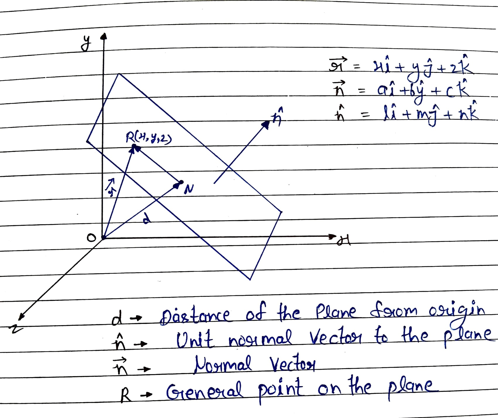

### 1. Variables & Vector Definitions
* **$d$**: Distance of the plane from the origin.
* **$\hat{n}$**: Unit normal vector to the plane.
* **$\vec{n}$**: Normal vector to the plane.
* **$R$**: General point on the plane with coordinates $(x, y, z)$.
* **$\vec{r}$**: Position vector of point $R$, where $\vec{r} = x\hat{i} + y\hat{j} + z\hat{k}$.
* **$\hat{n}$ Components**: $\hat{n} = l\hat{i} + m\hat{j} + n\hat{k}$.
* **$\vec{n}$ Components**: $\vec{n} = a\hat{i} + b\hat{j} + c\hat{k}$.

### 2. Geometric Setup
* Let $\vec{ON}$ be the perpendicular vector from the origin to the plane.
* The magnitude is $|\vec{ON}| = d$.
* Since $\vec{ON}$ is parallel to the unit normal vector $\hat{n}$ ($\vec{ON} \parallel \hat{n}$), it is defined as:
  $$ \vec{ON} = d\hat{n} $$

### 3. Triangle Law of Vector Addition
In $\Delta ONR$, applying the triangle law of vector addition:
$$ \vec{ON} + \vec{NR} = \vec{OR} $$
Substitute the known vectors ($\vec{OR} = \vec{r}$):
$$ d\hat{n} + \vec{NR} = \vec{r} $$
$$ \vec{NR} = \vec{r} - d\hat{n} $$

### 4. Deriving the Vector Equation
Since line segment $NR$ lies perfectly on the plane and $\vec{ON}$ is perpendicular to the plane, the two vectors must be orthogonal. Therefore, their dot product is zero:
$$ \vec{NR} \perp \vec{ON} \implies \vec{NR} \cdot \vec{ON} = 0 $$
Substitute the derived vector values:
$$ (\vec{r} - d\hat{n}) \cdot (d\hat{n}) = 0 $$
Divide out the constant $d$:
$$ (\vec{r} - d\hat{n}) \cdot \hat{n} = 0 $$
Expand the dot product:
$$ \vec{r} \cdot \hat{n} - d(\hat{n} \cdot \hat{n}) = 0 $$
Since the dot product of a unit vector with itself is 1 ($\hat{n} \cdot \hat{n} = 1$):
$$ \vec{r} \cdot \hat{n} - d = 0 $$

> **Final Vector Equation:** 
> $$ \vec{r} \cdot \hat{n} = d $$

### 5. Deriving the Cartesian Equations

**Form A: Using Direction Cosines (Unit Normal Vector)**
Substitute $\vec{r} = x\hat{i} + y\hat{j} + z\hat{k}$ and $\hat{n} = l\hat{i} + m\hat{j} + n\hat{k}$ into the vector equation:
$$ (x\hat{i} + y\hat{j} + z\hat{k}) \cdot (l\hat{i} + m\hat{j} + n\hat{k}) = d $$
> **Cartesian Equation 1:**
> $$ lx + my + nz = d $$

**Form B: Using Direction Ratios (General Normal Vector)**
Starting from the base vector equation, express $\hat{n}$ in terms of the general normal vector $\vec{n}$:
$$ \vec{r} \cdot \frac{\vec{n}}{|\vec{n}|} = d $$
$$ \vec{r} \cdot \vec{n} = d|\vec{n}| $$
Substitute $\vec{r} = x\hat{i} + y\hat{j} + z\hat{k}$ and $\vec{n} = a\hat{i} + b\hat{j} + c\hat{k}$:
$$ (x\hat{i} + y\hat{j} + z\hat{k}) \cdot (a\hat{i} + b\hat{j} + c\hat{k}) = d|\vec{n}| $$
> **Cartesian Equation 2:**
> $$ ax + by + cz = d|\vec{n}| $$

---

## 2. Equation of a Plane Passing Through a Given Point and Perpendicular to a Given Vector

  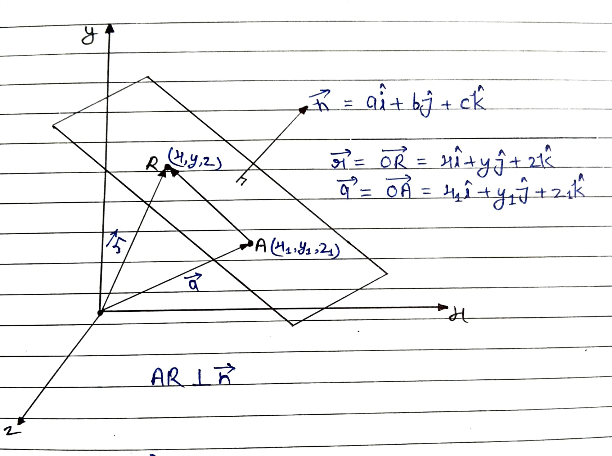

### 1. Variables & Vector Definitions
* **$A$**: A given point on the plane with coordinates $(x_1, y_1, z_1)$.
* **$\vec{a}$**: Position vector of point $A$, where $\vec{a} = \vec{OA} = x_1\hat{i} + y_1\hat{j} + z_1\hat{k}$.
* **$R$**: A general point on the plane with coordinates $(x, y, z)$.
* **$\vec{r}$**: Position vector of point $R$, where $\vec{r} = \vec{OR} = x\hat{i} + y\hat{j} + z\hat{k}$.
* **$\vec{n}$**: A given vector perpendicular (normal) to the plane, where $\vec{n} = a\hat{i} + b\hat{j} + c\hat{k}$.

### 2. Geometric Setup & Vector Equation
* The vector joining the given point $A$ to the general point $R$ is $\vec{AR}$.
* Using position vectors, we can define $\vec{AR} = \vec{r} - \vec{a}$.
* Since the vector $\vec{n}$ is perpendicular to the entire plane, it must be perpendicular to any line lying on the plane, including $\vec{AR}$.
* Therefore, $\vec{AR} \perp \vec{n}$.

Since the vectors are orthogonal, their dot product is zero:
$$ \vec{AR} \cdot \vec{n} = 0 $$

Substitute $\vec{AR} = \vec{r} - \vec{a}$:

> **Vector Form:**
> $$ (\vec{r} - \vec{a}) \cdot \vec{n} = 0 $$

### 3. Deriving the Cartesian Equation
Substitute the Cartesian components of $\vec{r}$, $\vec{a}$, and $\vec{n}$ into the vector equation:
$$ [(x\hat{i} + y\hat{j} + z\hat{k}) - (x_1\hat{i} + y_1\hat{j} + z_1\hat{k})] \cdot (a\hat{i} + b\hat{j} + c\hat{k}) = 0 $$

Group the respective $\hat{i}$, $\hat{j}$, and $\hat{k}$ components together:
$$ [(x - x_1)\hat{i} + (y - y_1)\hat{j} + (z - z_1)\hat{k}] \cdot (a\hat{i} + b\hat{j} + c\hat{k}) = 0 $$

Compute the dot product by multiplying the corresponding scalar components:

> **Cartesian Form:**
> $$ (x - x_1)a + (y - y_1)b + (z - z_1)c = 0 $$

---

## 3. Equation of the Plane Passing Through Three Non-Collinear Points

  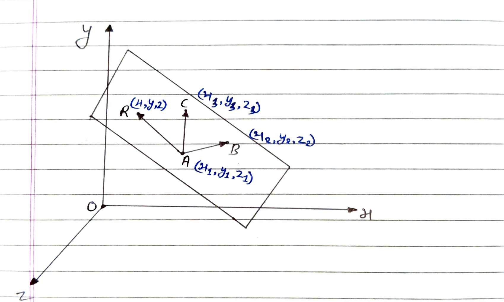

* **$A, B, C$**: Given points on the plane with coordinates $(x_1, y_1, z_1)$, $(x_2, y_2, z_2)$, and $(x_3, y_3, z_3)$.
* **$R$**: A general point on the plane with coordinates $(x, y, z)$.
* **$\vec{a}, \vec{b}, \vec{c}$**: Position vectors of points $A, B,$ and $C$.
* **$\vec{r}$**: Position vector of general point $R$.

The cross product $\vec{AB} \times \vec{AC}$ gives a vector perpendicular to both $\vec{AB}$ and $\vec{AC}$.
Therefore, $\vec{AB} \times \vec{AC}$ is a vector perpendicular to the entire plane.

Since the vector $\vec{AR}$ lies on the plane, it must be perpendicular to this normal vector:
$$ (\vec{AB} \times \vec{AC}) \perp \vec{AR} $$
$$ \vec{AR} \cdot (\vec{AB} \times \vec{AC}) = 0 $$

Substituting the position vectors ($\vec{AR} = \vec{r} - \vec{a}$, $\vec{AB} = \vec{b} - \vec{a}$, $\vec{AC} = \vec{c} - \vec{a}$):

> **Vector Equation:**
> $$ (\vec{r} - \vec{a}) \cdot [(\vec{b} - \vec{a}) \times (\vec{c} - \vec{a})] = 0 $$

### Deriving the Cartesian Equation

Here, the vectors are defined as:
$$ \vec{r} = x\hat{i} + y\hat{j} + z\hat{k} $$
$$ \vec{a} = x_1\hat{i} + y_1\hat{j} + z_1\hat{k} $$
$$ \vec{b} = x_2\hat{i} + y_2\hat{j} + z_2\hat{k} $$
$$ \vec{c} = x_3\hat{i} + y_3\hat{j} + z_3\hat{k} $$

Calculating the difference vectors:
$$ \vec{r} - \vec{a} = (x\hat{i} + y\hat{j} + z\hat{k}) - (x_1\hat{i} + y_1\hat{j} + z_1\hat{k}) $$
$$ \vec{r} - \vec{a} = (x - x_1)\hat{i} + (y - y_1)\hat{j} + (z - z_1)\hat{k} $$

$$ \vec{b} - \vec{a} = (x_2 - x_1)\hat{i} + (y_2 - y_1)\hat{j} + (z_2 - z_1)\hat{k} $$

$$ \vec{c} - \vec{a} = (x_3 - x_1)\hat{i} + (y_3 - y_1)\hat{j} + (z_3 - z_1)\hat{k} $$

Substitute these components into the scalar triple product $(\vec{r} - \vec{a}) \cdot [(\vec{b} - \vec{a}) \times (\vec{c} - \vec{a})] = 0$. Using the determinant form for a scalar triple product, we get:

> **Cartesian Equation:**
> $$ \begin{vmatrix} x - x_1 & y - y_1 & z - z_1 \\ x_2 - x_1 & y_2 - y_1 & z_2 - z_1 \\ x_3 - x_1 & y_3 - y_1 & z_3 - z_1 \end{vmatrix} = 0 $$-

---

## 4. Intercept Form of the Equation of a Plane

  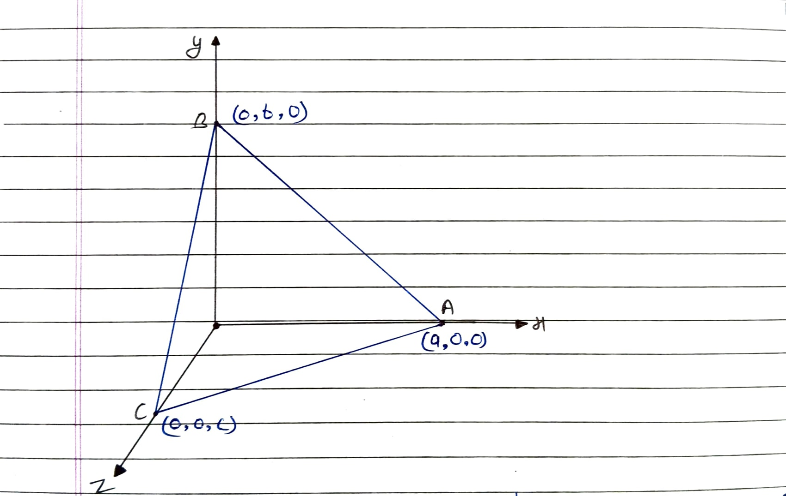

* **$a$**: $x$-intercept (Point $A$ is $(a, 0, 0)$)
* **$b$**: $y$-intercept (Point $B$ is $(0, b, 0)$)
* **$c$**: $z$-intercept (Point $C$ is $(0, 0, c)$)

Let the general equation of the plane be:
$$ Ax + By + Cz + D = 0 \quad \text{--- (1)} $$

Since the points $(a, 0, 0)$, $(0, b, 0)$, and $(0, 0, c)$ lie on the plane, they will satisfy the equation of the plane.

**For point $(a, 0, 0)$:**
$$ Aa + 0 + 0 + D = 0 $$
$$ Aa = -D $$
$$ A = \frac{-D}{a} \quad \text{--- (2)} $$

**For point $(0, b, 0)$:**
$$ 0 + Bb + 0 + D = 0 $$
$$ B = \frac{-D}{b} \quad \text{--- (3)} $$

**For point $(0, 0, c)$:**
$$ 0 + 0 + Cc + D = 0 $$
$$ C = \frac{-D}{c} \quad \text{--- (4)} $$

On putting the values of $A, B,$ and $C$ back into equation (1):
$$ \left(\frac{-D}{a}\right)x - \left(\frac{D}{b}\right)y - \left(\frac{D}{c}\right)z + D = 0 $$

Taking $-D$ common:
$$ -D \left( \frac{x}{a} + \frac{y}{b} + \frac{z}{c} + (-1) \right) = 0 $$

$$ \frac{x}{a} + \frac{y}{b} + \frac{z}{c} - 1 = 0 $$

> **Final Equation (Intercept Form):**
> $$ \frac{x}{a} + \frac{y}{b} + \frac{z}{c} = 1 $$

---

## 5. A Plane Passing Through the Intersection of Two Given Planes

  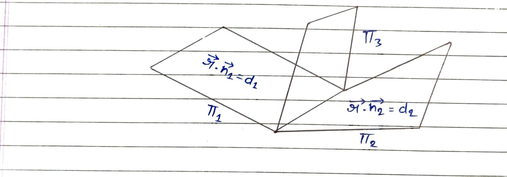

### Concept of Family of Curves
Let there be two curves:
* Curve 1: $S_1 = 0$
* Curve 2: $S_2 = 0$

The equation of a curve passing through the intersection of the two curves is given by:
$$ S_1 + \lambda S_2 = 0 $$

### Applying to Planes
Let the vector equations of the two given intersecting planes ($\pi_1$ and $\pi_2$) be:
* **Plane 1:** $\vec{r} \cdot \vec{n}_1 = d_1 \implies \vec{r} \cdot \vec{n}_1 - d_1 = 0$
* **Plane 2:** $\vec{r} \cdot \vec{n}_2 = d_2 \implies \vec{r} \cdot \vec{n}_2 - d_2 = 0$

Equation of the family of planes ($\pi_3$) passing through the intersection of the two planes is:
$$ (\vec{r} \cdot \vec{n}_1 - d_1) + \lambda (\vec{r} \cdot \vec{n}_2 - d_2) = 0 $$

Expanding the terms:
$$ \vec{r} \cdot \vec{n}_1 - d_1 + \vec{r} \cdot (\lambda \vec{n}_2) - \lambda d_2 = 0 $$

Grouping the $\vec{r}$ terms on the left and moving the constants to the right side:
$$ \vec{r} \cdot \vec{n}_1 + \vec{r} \cdot (\lambda \vec{n}_2) = d_1 + \lambda d_2 $$

Factoring out the common position vector $\vec{r}$ using the distributive property of the dot product:

> **Vector Equation:**
> $$ \vec{r} \cdot (\vec{n}_1 + \lambda \vec{n}_2) = d_1 + \lambda d_2 \quad \{\lambda \in \mathbb{R}\} $$

---

## 6. Condition for Two Lines to be Coplanar

  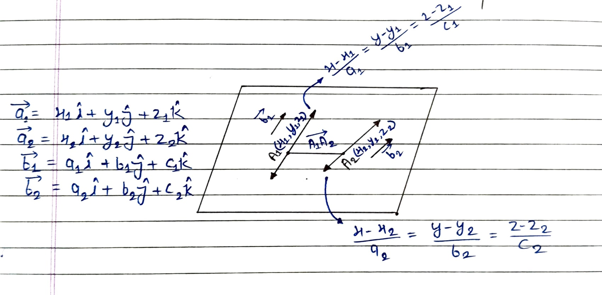

### 1. Variables & Vector Definitions
* **Line 1** passes through point $A_1(x_1, y_1, z_1)$ and is parallel to vector $\vec{b}_1$.
  * Cartesian equation: $\frac{x - x_1}{a_1} = \frac{y - y_1}{b_1} = \frac{z - z_1}{c_1}$
  * Position vector of $A_1$: $\vec{a}_1 = x_1\hat{i} + y_1\hat{j} + z_1\hat{k}$
  * Direction vector: $\vec{b}_1 = a_1\hat{i} + b_1\hat{j} + c_1\hat{k}$
* **Line 2** passes through point $A_2(x_2, y_2, z_2)$ and is parallel to vector $\vec{b}_2$.
  * Cartesian equation: $\frac{x - x_2}{a_2} = \frac{y - y_2}{b_2} = \frac{z - z_2}{c_2}$
  * Position vector of $A_2$: $\vec{a}_2 = x_2\hat{i} + y_2\hat{j} + z_2\hat{k}$
  * Direction vector: $\vec{b}_2 = a_2\hat{i} + b_2\hat{j} + c_2\hat{k}$

### 2. Geometric Setup & Vector Equation
The cross product $(\vec{b}_1 \times \vec{b}_2)$ gives a vector that is perpendicular to both lines. Since both lines lie on the same plane (they are coplanar), this vector is perpendicular to the entire plane.

The vector connecting point $A_1$ on Line 1 to point $A_2$ on Line 2 is $\vec{A_1A_2}$, where $\vec{A_1A_2} = \vec{a}_2 - \vec{a}_1$.
Because $\vec{A_1A_2}$ lies on the plane, it must be perpendicular to the normal vector $(\vec{b}_1 \times \vec{b}_2)$.

Therefore:
$$ \vec{A_1A_2} \perp (\vec{b}_1 \times \vec{b}_2) $$
$$ \vec{A_1A_2} \cdot (\vec{b}_1 \times \vec{b}_2) = 0 $$

Substituting $\vec{A_1A_2} = \vec{a}_2 - \vec{a}_1$:

> **Vector Form:**
> $$ (\vec{a}_2 - \vec{a}_1) \cdot (\vec{b}_1 \times \vec{b}_2) = 0 $$

### 3. Deriving the Cartesian Form
First, calculate the difference between the position vectors:
$$ \vec{a}_2 - \vec{a}_1 = (x_2 - x_1)\hat{i} + (y_2 - y_1)\hat{j} + (z_2 - z_1)\hat{k} $$

The vector equation is a scalar triple product of the vectors $(\vec{a}_2 - \vec{a}_1)$, $\vec{b}_1$, and $\vec{b}_2$. We can represent this scalar triple product directly as a determinant set to zero:

> **Cartesian Form:**
> $$ \begin{vmatrix} x_2 - x_1 & y_2 - y_1 & z_2 - z_1 \\ a_1 & b_1 & c_1 \\ a_2 & b_2 & c_2 \end{vmatrix} = 0 $$

---

## 7. Angle Between Two Planes

  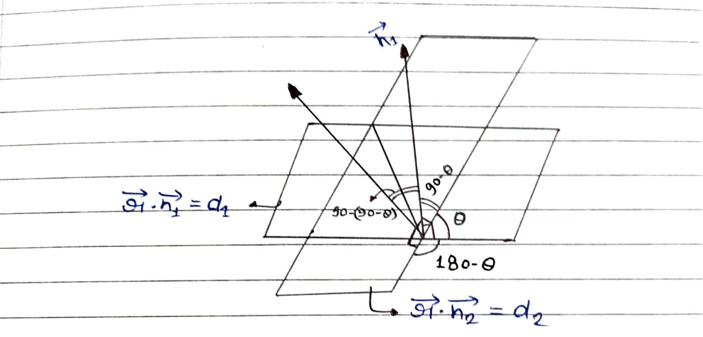

* **Plane 1:** $\vec{r} \cdot \vec{n}_1 = d_1$
* **Plane 2:** $\vec{r} \cdot \vec{n}_2 = d_2$
* Let the angle between the two planes $= \theta$.

From the geometric projection, the angle between their normal vectors $\vec{n}_1$ and $\vec{n}_2$ is calculated as:
$$ 90^\circ - (90^\circ - \theta) = \theta $$

Therefore, **the angle between two planes is equal to the angle between their normal vectors.**

> **Angle Formula:**
> $$ \cos \theta = \left| \frac{\vec{n}_1 \cdot \vec{n}_2}{|\vec{n}_1| |\vec{n}_2|} \right| $$

### Conditions

**(i) If the planes are perpendicular:**
Their normal vectors will also be perpendicular ($\vec{n}_1 \perp \vec{n}_2$).
$$ \vec{n}_1 \cdot \vec{n}_2 = 0 $$
$$ \text{or} \quad a_1a_2 + b_1b_2 + c_1c_2 = 0 $$

**(ii) If both planes are parallel:**
Their normal vectors will also be parallel ($\vec{n}_1 \parallel \vec{n}_2$).
$$ \vec{n}_1 = \lambda \vec{n}_2 $$
$$ \text{or} \quad \frac{a_1}{a_2} = \frac{b_1}{b_2} = \frac{c_1}{c_2} $$

---

## 8. Distance of a Given Point from a Plane

  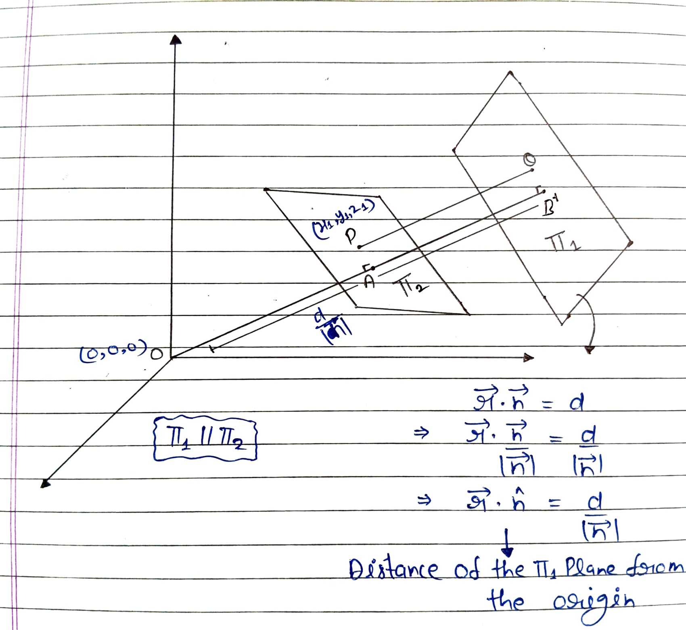

Let there be a plane $\pi_1$ and a point $P(x_1, y_1, z_1)$ with position vector $\vec{a}$. We pass a plane $\pi_2$ through point $P$ such that $\pi_1 \parallel \pi_2$. 

**Equation of Plane $\pi_1$:**
$$ \vec{r} \cdot \vec{n} = d $$
$$ \implies \frac{\vec{r} \cdot \vec{n}}{|\vec{n}|} = \frac{d}{|\vec{n}|} $$
$$ \implies \vec{r} \cdot \hat{n} = \frac{d}{|\vec{n}|} $$
*Here, $\frac{d}{|\vec{n}|}$ is the distance of the $\pi_1$ plane from the origin (distance $OB$).*

The unit vector perpendicular to both $\pi_1$ and $\pi_2$ is $\hat{n}$.

**Equation of Plane $\pi_2$:**
Since the plane passes through point $P(\vec{a})$ and has normal $\vec{n}$:
$$ (\vec{r} - \vec{a}) \cdot \vec{n} = 0 $$
$$ \implies \vec{r} \cdot \vec{n} - \vec{a} \cdot \vec{n} = 0 $$
$$ \implies \vec{r} \cdot \vec{n} = \vec{a} \cdot \vec{n} $$
$$ \implies \frac{\vec{r} \cdot \vec{n}}{|\vec{n}|} = \frac{\vec{a} \cdot \vec{n}}{|\vec{n}|} $$
$$ \implies \vec{r} \cdot \hat{n} = \frac{\vec{a} \cdot \vec{n}}{|\vec{n}|} $$
*Here, $\frac{\vec{a} \cdot \vec{n}}{|\vec{n}|}$ is the distance of the $\pi_2$ plane from the origin (distance $OA$).*

**Calculating Distance $PQ$:**
The perpendicular distance from point $P$ to plane $\pi_1$ is $PQ$. Based on the projection on the normal vector:
$$ PQ = AB = OB - OA $$
$$ PQ = \frac{d}{|\vec{n}|} - \frac{\vec{a} \cdot \vec{n}}{|\vec{n}|} $$
$$ PQ = \frac{d - \vec{a} \cdot \vec{n}}{|\vec{n}|} $$

Taking the absolute value (since distance is always positive):
$$ PQ = \left| \frac{\vec{a} \cdot \vec{n} - d}{|\vec{n}|} \right| $$

> **Vector Form:**
> $$ PQ = \left| \frac{\vec{a} \cdot \vec{n} - d}{|\vec{n}|} \right| $$

### Deriving the Cartesian Equation

Substitute the position vector $\vec{a} = x_1\hat{i} + y_1\hat{j} + z_1\hat{k}$ and the normal vector $\vec{n} = a\hat{i} + b\hat{j} + c\hat{k}$:
$$ PQ = \left| \frac{(x_1\hat{i} + y_1\hat{j} + z_1\hat{k}) \cdot (a\hat{i} + b\hat{j} + c\hat{k}) - d}{\sqrt{a^2 + b^2 + c^2}} \right| $$

Applying the dot product in the numerator:

> **Cartesian Equation:**
> $$ PQ = \left| \frac{ax_1 + by_1 + cz_1 - d}{\sqrt{a^2 + b^2 + c^2}} \right| $$

---

## 9. Angle Between a Line and a Plane

  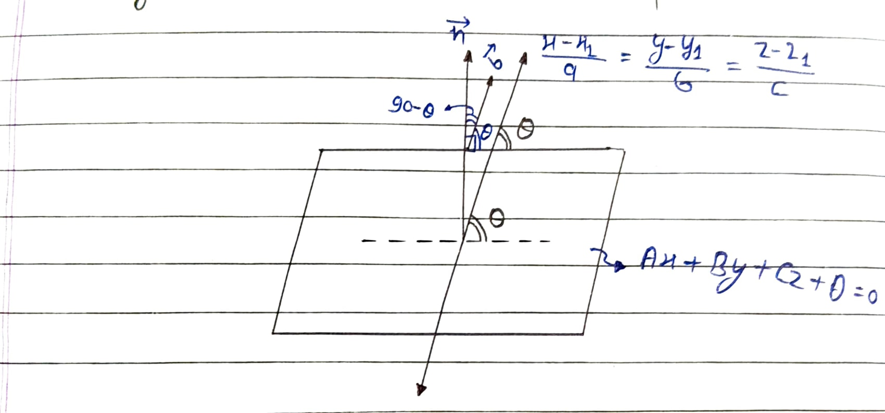

### 1. Variables & Geometric Setup
* **Equation of the Plane:** $Ax + By + Cz + D = 0$
  * Normal vector to the plane: $\vec{n}$
* **Equation of the Line:** $\frac{x - x_1}{a} = \frac{y - y_1}{b} = \frac{z - z_1}{c}$
  * Direction vector of the line: $\vec{b}$
* Let the angle between the line and the plane be **$\theta$**.

### 2. Deriving the Angle Formula
From the geometric projection, the normal vector $\vec{n}$ is perfectly perpendicular to the plane ($90^\circ$). 
Therefore, if the angle between the line and the plane is $\theta$, the angle between the normal vector $\vec{n}$ and the line's direction vector $\vec{b}$ must be **$(90^\circ - \theta)$**.

Using the standard dot product formula to find the angle between vectors $\vec{n}$ and $\vec{b}$:
$$ \cos(90^\circ - \theta) = \left| \frac{\vec{n} \cdot \vec{b}}{|\vec{n}| |\vec{b}|} \right| $$

By trigonometric identity, we know that $\cos(90^\circ - \theta) = \sin\theta$. Substituting this into the equation:
$$ \sin\theta = \left| \frac{\vec{n} \cdot \vec{b}}{|\vec{n}| |\vec{b}|} \right| $$

> **Final Angle Equation:**
> $$ \theta = \sin^{-1} \left| \frac{\vec{n} \cdot \vec{b}}{|\vec{n}| |\vec{b}|} \right| $$

---

## Algorithm: Foot of the Perpendicular

  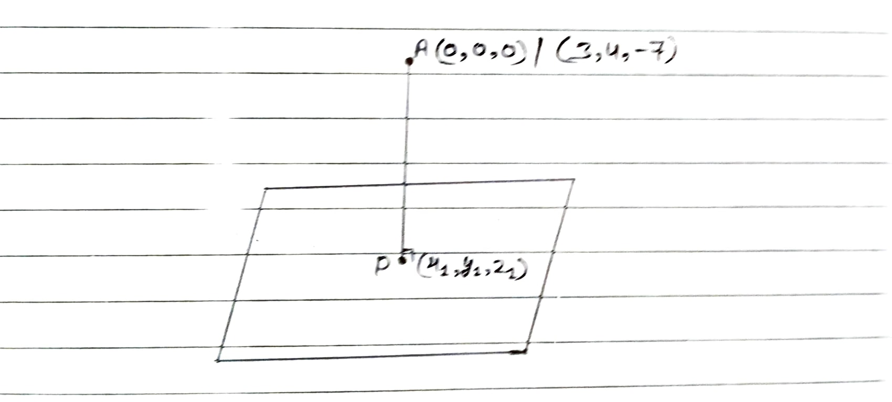

**Question:** Find the coordinates of the foot of the perpendicular drawn from the origin to the plane $2x - 3y + 4z - 6 = 0$.

  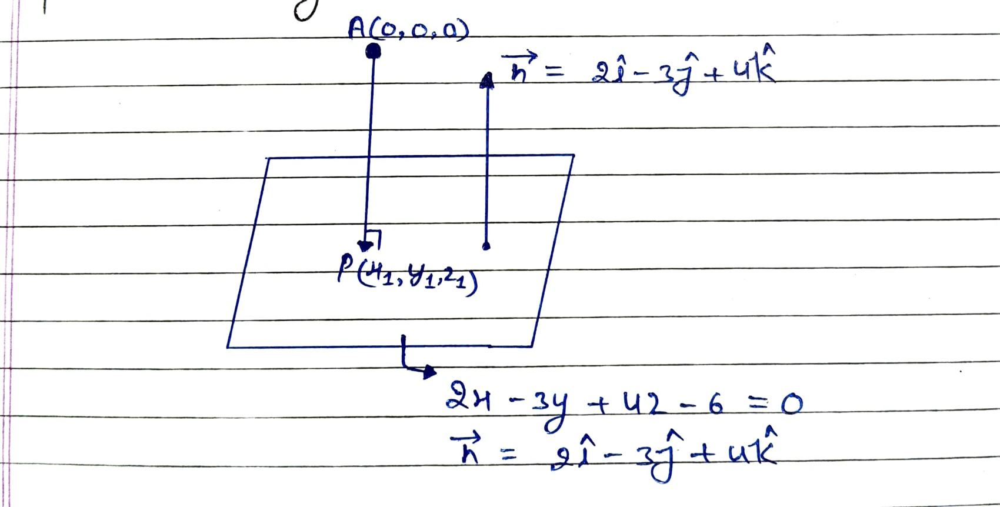

### Step 1: Identify the Vectors
* From the plane's equation $2x - 3y + 4z - 6 = 0$, the normal vector is extracted as:
  $$ \vec{n} = 2\hat{i} - 3\hat{j} + 4\hat{k} $$
* Let the foot of the perpendicular on the plane be $P(x_1, y_1, z_1)$ and the origin be $A(0,0,0)$.
* The vector representing the perpendicular line from the origin is:
  $$ \vec{AP} = x_1\hat{i} + y_1\hat{j} + z_1\hat{k} $$

### Step 2: Apply the Condition for Parallel Vectors
* Because the line $\vec{AP}$ is perpendicular to the plane, it will be parallel to the plane's normal vector $\vec{n}$ ($\vec{AP} \parallel \vec{n}$).
* For parallel vectors, their direction ratios must be proportional:
  $$ \frac{x_1}{2} = \frac{y_1}{-3} = \frac{z_1}{4} $$

### Step 3: Define a General Point Using a Constant ($\lambda$)
* By equating these proportional ratios to a constant $\lambda$, we get:
  $$ x_1 = 2\lambda, \quad y_1 = -3\lambda, \quad z_1 = 4\lambda $$
* This establishes the general coordinates for Point $P$ as:
  $$ (2\lambda, -3\lambda, 4\lambda) $$

### Step 4: Satisfy the Plane's Equation
* Since Point $P$ lies directly on the plane, its coordinates must satisfy the equation of the plane.
* Substituting the general coordinates into the plane's equation:
  $$ 2(2\lambda) - 3(-3\lambda) + 4(4\lambda) = 6 $$
* Solving for $\lambda$:
  $$ 4\lambda + 9\lambda + 16\lambda = 6 \implies 29\lambda = 6 \implies \lambda = \frac{6}{29} $$

### Step 5: Calculate the Final Coordinates
* Substitute the calculated value of $\lambda$ back into the general coordinates of Point $P$ to find the exact location:
  $$ P \left( \frac{12}{29}, -\frac{18}{29}, \frac{24}{29} \right) $$

---

## 10. Line Through the Intersection of Two Planes

  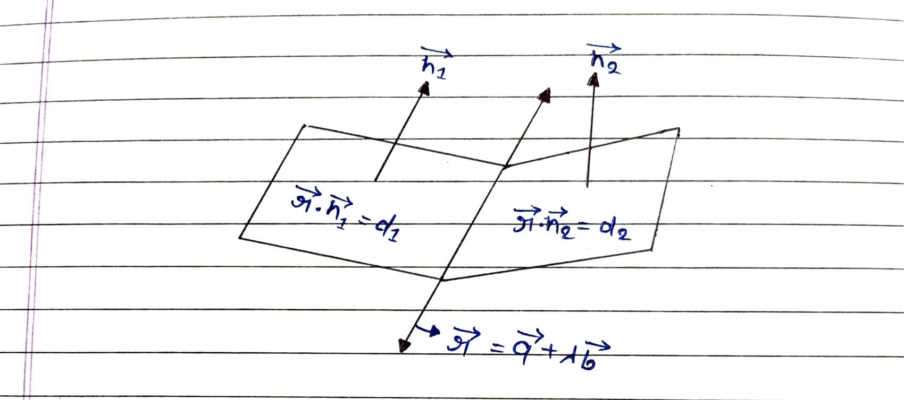

**Given Planes:** 
$$ \vec{r} \cdot \vec{n}_1 = d_1 \quad \text{--- (1)} $$
$$ \vec{r} \cdot \vec{n}_2 = d_2 \quad \text{--- (2)} $$

**Suppose, equation of the line:** 
$$ \vec{r} = \vec{a} + \lambda\vec{b} $$

Since the line of intersection lies on the surfaces of both planes, it will be perpendicular to both normal vectors:
$$ \vec{n}_1 \times \vec{n}_2 \parallel \text{Line} $$
$$ \implies \vec{b} = \vec{n}_1 \times \vec{n}_2 $$

Therefore, the direction of the line ($\vec{b}$) = $\vec{n}_1 \times \vec{n}_2$.

Let $\vec{a}$ be a point lying on the line; since it lies on both planes, it will satisfy both equations.
Putting $\vec{r} = \vec{a}$ in equations (1) and (2):
$$ \implies \vec{a} \cdot \vec{n}_1 = d_1 \quad \text{--- (3)} $$
$$ \text{and} \quad \vec{a} \cdot \vec{n}_2 = d_2 \quad \text{--- (4)} $$

Assuming this point is the closest to the origin, the position vector $\vec{a}$ will be perpendicular to the vector $\vec{b}$ parallel to the line.
$$ \implies \vec{a} \cdot \vec{b} = 0 \quad \text{--- (5)} $$

**Using vector triple product:**
$$ \vec{a} \times \vec{b} = \vec{a} \times (\vec{n}_1 \times \vec{n}_2) $$
$$ \implies \vec{a} \times \vec{b} = (\vec{a} \cdot \vec{n}_2)\vec{n}_1 - (\vec{a} \cdot \vec{n}_1)\vec{n}_2 \quad \text{--- (6)} $$

Substituting the values from equations (3) and (4) into equation (6):
$$ \vec{a} \times \vec{b} = d_2\vec{n}_1 - d_1\vec{n}_2 $$
$$ \implies \vec{a} \times \vec{b} = -(d_1\vec{n}_2 - d_2\vec{n}_1) $$

On multiplying both sides by the vector $\vec{b}$:
$$ \vec{b} \times (\vec{a} \times \vec{b}) = \vec{b} \times [-(d_1\vec{n}_2 - d_2\vec{n}_1)] $$
*Using the vector triple product property and reversing the cross product to absorb the negative sign:*
$$ \implies (\vec{b} \cdot \vec{b})\vec{a} - (\vec{b} \cdot \vec{a})\vec{b} = (d_1\vec{n}_2 - d_2\vec{n}_1) \times \vec{b} $$

Substituting $\vec{a} \cdot \vec{b} = 0$ from equation (5):
$$ \implies |\vec{b}|^2 \vec{a} - (0)\vec{b} = (d_1\vec{n}_2 - d_2\vec{n}_1) \times \vec{b} $$
$$ \implies |\vec{b}|^2 \vec{a} = (d_1\vec{n}_2 - d_2\vec{n}_1) \times \vec{b} $$
$$ \implies \vec{a} = \frac{(d_1\vec{n}_2 - d_2\vec{n}_1) \times \vec{b}}{|\vec{b}|^2} $$

Substituting $\vec{a}$ and $\vec{b}$ in the vector equation of the line ($\vec{r} = \vec{a} + \lambda\vec{b}$):

> **Final Vector Equation:**
> $$ \vec{r} = \frac{[(d_1\vec{n}_2) - (d_2\vec{n}_1)] \times (\vec{n}_1 \times \vec{n}_2)}{|\vec{n}_1 \times \vec{n}_2|^2} + \lambda(\vec{n}_1 \times \vec{n}_2) $$

---

## 11. Point of Intersection of a Plane and a Line

  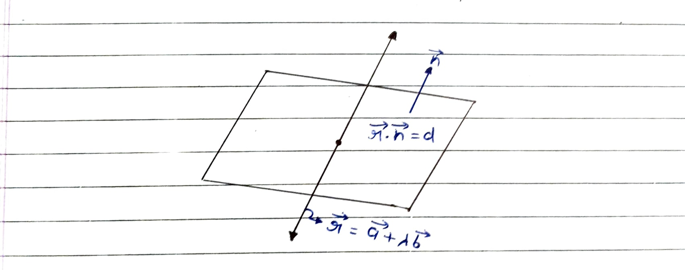

Since the point where the line intersects the plane lies on both the line and the plane, the position vector of that point will satisfy the equation of the plane.

$$ \vec{r} = \vec{a} + \lambda\vec{b} \quad \text{--- (1)} $$
$$ \vec{r} \cdot \vec{n} = d \quad \text{--- (2)} $$

Substituting equation (1) into equation (2):
$$ (\vec{a} + \lambda\vec{b}) \cdot \vec{n} = d $$

$$ \implies \vec{a} \cdot \vec{n} + \lambda\vec{b} \cdot \vec{n} = d $$
$$ \implies \lambda\vec{b} \cdot \vec{n} = d - \vec{a} \cdot \vec{n} $$
$$ \implies \lambda = \frac{d - \vec{a} \cdot \vec{n}}{\vec{b} \cdot \vec{n}} $$

On putting the value of $\lambda$ in the equation of the line:

> **Position Vector of the Point of Intersection:**
> $$ \vec{r} = \vec{a} + \left( \frac{d - \vec{a} \cdot \vec{n}}{\vec{b} \cdot \vec{n}} \right) \vec{b} $$

---

## 12. The Distance from One Plane to Another

  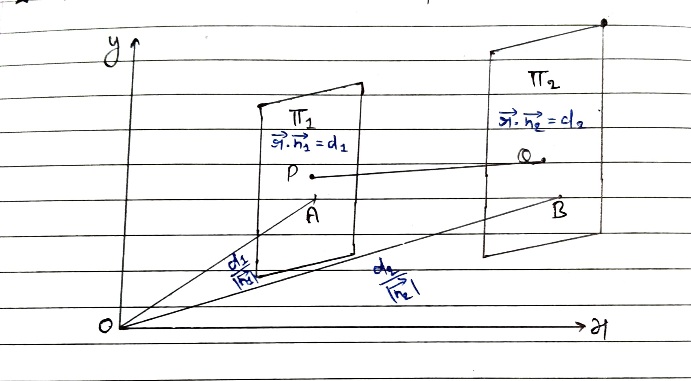

**Distance of $\pi_1$ from origin -**
$$ \vec{r} \cdot \vec{n}_1 = d_1 $$
$$ \implies \frac{\vec{r} \cdot \vec{n}_1}{|\vec{n}_1|} = \frac{d_1}{|\vec{n}_1|} $$
$$ \implies \vec{r} \cdot \hat{n} = \frac{d_1}{|\vec{n}_1|} $$

**Distance of $\pi_2$ from origin -**
$$ \vec{r} \cdot \vec{n}_2 = d_2 $$
$$ \implies \frac{\vec{r} \cdot \vec{n}_2}{|\vec{n}_2|} = \frac{d_2}{|\vec{n}_2|} $$
$$ \implies \vec{r} \cdot \hat{n} = \frac{d_2}{|\vec{n}_2|} $$

**Calculating the Distance between Planes:**
$$ OB - OA = PQ = \frac{d_2}{|\vec{n}_2|} - \frac{d_1}{|\vec{n}_1|} $$

> **Final Distance Formula:**
> $$ \implies PQ = \left| \frac{d_2}{|\vec{n}_2|} - \frac{d_1}{|\vec{n}_1|} \right| $$

---

## 13. Angle Between the Line and the Plane (Vector Form)

  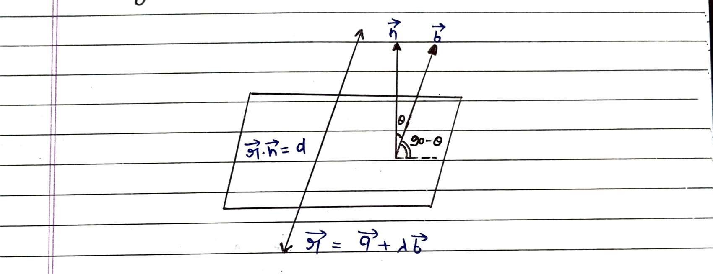

* **Equation of the Plane:** $\vec{r} \cdot \vec{n} = d$
* **Equation of the Line:** $\vec{r} = \vec{a} + \lambda\vec{b}$

Let the angle between the line and the plane = $\theta$. 
From the geometric setup, the angle between the plane's normal vector $\vec{n}$ and the line's direction vector $\vec{b}$ is $(90^\circ - \theta)$.

Using the standard dot product formula to find the angle between vectors $\vec{b}$ and $\vec{n}$:
$$ \cos(90^\circ - \theta) = \frac{\vec{b} \cdot \vec{n}}{|\vec{b}| |\vec{n}|} $$

Applying the trigonometric identity $\cos(90^\circ - \theta) = \sin\theta$:
$$ \implies \sin\theta = \frac{\vec{b} \cdot \vec{n}}{|\vec{b}| |\vec{n}|} $$

Taking the absolute value to ensure we get the acute angle:

> **Final Angle Equation:**
> $$ \implies \theta = \sin^{-1} \left| \frac{\vec{b} \cdot \vec{n}}{|\vec{b}| |\vec{n}|} \right| $$

---

## 14. Angle Bisector Plane

  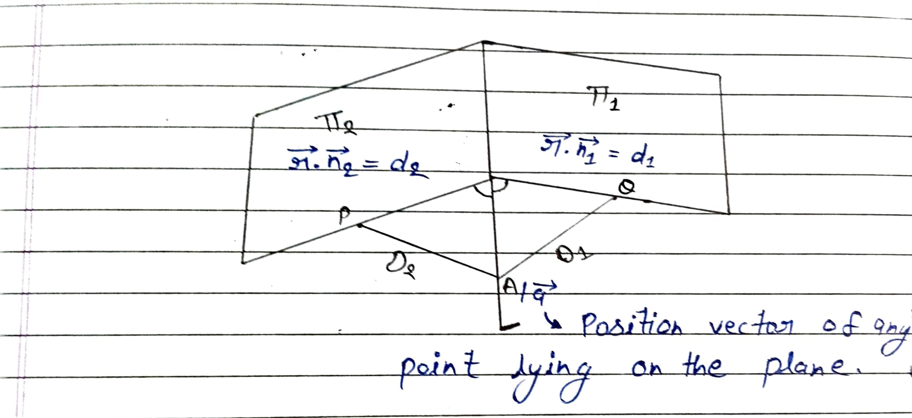

Assume planes:
$$ \vec{r} \cdot \hat{n}_1 = d_1 \quad \text{and} \quad \vec{r} \cdot \hat{n}_2 = d_2 $$

We know that the distance of any point lying on the bisector plane from both planes will be equal.

**Distance of point $\vec{a}$ from plane $\pi_1$:**
$$ D_1 = |\vec{a} \cdot \hat{n}_1 - d_1| \quad \text{--- (1)} $$

**Distance of point $\vec{a}$ from plane $\pi_2$:**
$$ D_2 = |\vec{a} \cdot \hat{n}_2 - d_2| \quad \text{--- (2)} $$

Since $D_1$ and $D_2$ are equal ($D_1 = D_2$):
$$ |\vec{a} \cdot \hat{n}_1 - d_1| = |\vec{a} \cdot \hat{n}_2 - d_2| $$
$$ \implies \vec{a} \cdot \hat{n}_1 - d_1 = \pm (\vec{a} \cdot \hat{n}_2 - d_2) $$

Splitting into two cases based on the sign:

**Case 1 (Positive Sign):**
$$ \vec{a} \cdot \hat{n}_1 - d_1 = \vec{a} \cdot \hat{n}_2 - d_2 $$
$$ \implies \vec{a} \cdot \hat{n}_1 - \vec{a} \cdot \hat{n}_2 = d_1 - d_2 $$

> **First Bisector Plane Equation:**
> $$ \vec{a} \cdot (\hat{n}_1 - \hat{n}_2) = d_1 - d_2 $$

**Case 2 (Negative Sign):**
$$ \vec{a} \cdot \hat{n}_1 - d_1 = -(\vec{a} \cdot \hat{n}_2 - d_2) $$
$$ \implies \vec{a} \cdot \hat{n}_1 + \vec{a} \cdot \hat{n}_2 = d_1 + d_2 $$

> **Second Bisector Plane Equation:**
> $$ \vec{a} \cdot (\hat{n}_1 + \hat{n}_2) = d_1 + d_2 $$

---

## 15. Projection of a Line on a Plane

  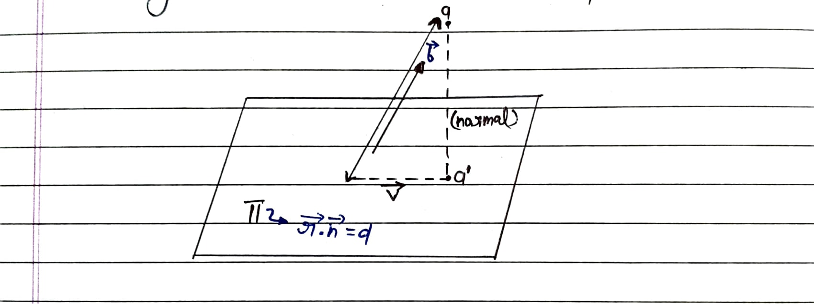

**Given:**
* **Line ($L$):** $\vec{r} = \vec{a} + \lambda\vec{b}$ (Passes through $\vec{a}$, direction $\vec{b}$)
* **Plane ($\pi$):** $\vec{r} \cdot \vec{n} = d$ (Normal vector $\vec{n}$)

### Step 1: Find the projected Point ($\vec{a}'$)
We drop a perpendicular from point $\vec{a}$ to the plane.

1. The equation of this vertical drop line is:
   $$ \vec{r} = \vec{a} + t\vec{n} $$

2. Since the foot of this perpendicular ($\vec{a}'$) lies on the plane, it must satisfy the plane's equation:
   $$ (\vec{a} + t\vec{n}) \cdot \vec{n} = d $$
   $$ \implies \vec{a} \cdot \vec{n} + t(\vec{n} \cdot \vec{n}) = d $$
   $$ \implies \vec{a} \cdot \vec{n} + t|\vec{n}|^2 = d $$
   $$ \implies t|\vec{n}|^2 = d - \vec{a} \cdot \vec{n} $$
   $$ \implies t = \frac{d - (\vec{a} \cdot \vec{n})}{|\vec{n}|^2} $$

Substitute $t$ back into the drop line equation to get Point $\vec{a}'$:
$$ \vec{a}' = \vec{a} + \left( \frac{d - \vec{a} \cdot \vec{n}}{|\vec{n}|^2} \right)\vec{n} $$

### Step 2: Find the projected Direction ($\vec{v}$)
The original direction $\vec{b}$ consists of a horizontal part (along the plane) and a vertical part (along the normal $\vec{n}$).

1. The vertical part is the vector projection of $\vec{b}$ onto $\vec{n}$:
   $$ \text{Vertical Part} = \left( \frac{\vec{b} \cdot \vec{n}}{|\vec{n}|^2} \right)\vec{n} $$

2. Subtract the vertical part from the total direction $\vec{b}$ to get the horizontal Direction $\vec{v}$:
   $$ \vec{v} = \vec{b} - \left( \frac{\vec{b} \cdot \vec{n}}{|\vec{n}|^2} \right)\vec{n} $$

### Step 3: Write the final Equation
Combine the new point and new direction.

> **Projected Line Equation ($L'$):**
> $$ L': \vec{r} = \vec{a}' + \mu\vec{v} $$

---

## 16. Image (Reflection) of a Point in a Plane

  

**Given:**
* **Point ($P$):** Position vector $\vec{a}$
* **Plane ($\pi$):** $\vec{r} \cdot \vec{n} = d$
* Let the image of point $P$ be $P'$ with position vector $\vec{a}'$.

### Step 1: Equation of the Line and Midpoint
The line passing through $P$ and perpendicular to the plane will be parallel to the normal vector $\vec{n}$.
The equation of this line is:
$$ \vec{r} = \vec{a} + \lambda\vec{n} $$

Since the image point $P'$ lies on this line, its position vector can be written as:
$$ \vec{a}' = \vec{a} + \lambda\vec{n} \quad \text{--- (1)} $$

The midpoint $M$ of the line segment $PP'$ will lie exactly on the plane. The position vector of $M$ is:
$$ \vec{m} = \frac{\vec{a} + \vec{a}'}{2} $$
Substitute $\vec{a}'$ from equation (1):
$$ \vec{m} = \frac{\vec{a} + (\vec{a} + \lambda\vec{n})}{2} = \vec{a} + \frac{\lambda}{2}\vec{n} $$

### Step 2: Satisfy the Plane's Equation
Since midpoint $M$ lies on the plane, it must satisfy $\vec{r} \cdot \vec{n} = d$:
$$ \left( \vec{a} + \frac{\lambda}{2}\vec{n} \right) \cdot \vec{n} = d $$
$$ \implies \vec{a} \cdot \vec{n} + \frac{\lambda}{2}(\vec{n} \cdot \vec{n}) = d $$
$$ \implies \vec{a} \cdot \vec{n} + \frac{\lambda}{2}|\vec{n}|^2 = d $$
$$ \implies \frac{\lambda}{2}|\vec{n}|^2 = d - \vec{a} \cdot \vec{n} $$
$$ \implies \lambda = \frac{2(d - \vec{a} \cdot \vec{n})}{|\vec{n}|^2} $$

### Step 3: Final Position Vector
Substitute $\lambda$ back into equation (1) to get the position vector of the image point $P'$:

> **Vector Equation for Image of a Point:**
> $$ \vec{a}' = \vec{a} + \frac{2(d - \vec{a} \cdot \vec{n})}{|\vec{n}|^2}\vec{n} $$

---

## 17. Distance of a Point from a Plane (Measured Parallel to a Line)

  

**Given:**
* **Point ($P$):** Position vector $\vec{a}$
* **Plane ($\pi$):** $\vec{r} \cdot \vec{n} = d$
* **Given Direction:** Vector $\vec{b}$ (The direction parallel to which distance is measured)

### Step 1: Find the Intersection Point ($Q$)
We draw a line from point $P$ parallel to vector $\vec{b}$ until it intersects the plane at point $Q$.
The equation of this line is:
$$ \vec{r} = \vec{a} + \lambda\vec{b} $$

Since $Q$ lies on the plane, it must satisfy the plane's equation:
$$ (\vec{a} + \lambda\vec{b}) \cdot \vec{n} = d $$
$$ \implies \vec{a} \cdot \vec{n} + \lambda(\vec{b} \cdot \vec{n}) = d $$
$$ \implies \lambda = \frac{d - \vec{a} \cdot \vec{n}}{\vec{b} \cdot \vec{n}} $$

### Step 2: Calculate the Distance
The vector connecting point $P$ to intersection point $Q$ is $\vec{PQ}$.
$$ \vec{PQ} = \vec{q} - \vec{a} = (\vec{a} + \lambda\vec{b}) - \vec{a} = \lambda\vec{b} $$

The distance is the magnitude of vector $\vec{PQ}$:
$$ PQ = |\vec{PQ}| = |\lambda\vec{b}| = |\lambda| |\vec{b}| $$

Substitute the value of $\lambda$:

> **Final Distance Formula:**
> $$ PQ = \left| \frac{d - \vec{a} \cdot \vec{n}}{\vec{b} \cdot \vec{n}} \right| |\vec{b}| $$

---

## 18. Image (Reflection) of a Line in a Plane

  

**Given:**
* **Original Line ($L$):** $\vec{r} = \vec{a} + \mu\vec{b}$
* **Plane ($\pi$):** $\vec{r} \cdot \vec{n} = d$

To find the reflected line, we need two things: a point on the reflected line, and the reflected direction vector.

### Step 1: Find a Point on the Reflected Line ($\vec{a}'$)
We can simply find the image of point $\vec{a}$ in the plane using the formula from Derivation 16:
$$ \vec{a}' = \vec{a} + \frac{2(d - \vec{a} \cdot \vec{n})}{|\vec{n}|^2}\vec{n} $$

### Step 2: Find the Reflected Direction ($\vec{v}$)
When a vector $\vec{b}$ is reflected across a normal $\vec{n}$, its component parallel to the plane remains the same, but its component along the normal is inverted.
* The component of $\vec{b}$ along the normal $\vec{n}$ is: $\vec{b}_{\parallel} = \left( \frac{\vec{b} \cdot \vec{n}}{|\vec{n}|^2} \right)\vec{n}$
* The component of $\vec{b}$ along the plane is: $\vec{b}_{\perp} = \vec{b} - \vec{b}_{\parallel}$

The reflected direction vector $\vec{v}$ will have the same plane component but the negative normal component:
$$ \vec{v} = \vec{b}_{\perp} - \vec{b}_{\parallel} $$
$$ \vec{v} = (\vec{b} - \vec{b}_{\parallel}) - \vec{b}_{\parallel} = \vec{b} - 2\vec{b}_{\parallel} $$

Substituting $\vec{b}_{\parallel}$ back:
$$ \vec{v} = \vec{b} - 2\left( \frac{\vec{b} \cdot \vec{n}}{|\vec{n}|^2} \right)\vec{n} $$

### Step 3: Write the Final Equation
Combine the reflected point $\vec{a}'$ and the reflected direction $\vec{v}$.

> **Reflected Line Equation ($L'$):**
> $$ L': \vec{r} = \left[ \vec{a} + \frac{2(d - \vec{a} \cdot \vec{n})}{|\vec{n}|^2}\vec{n} \right] + \lambda \left[ \vec{b} - 2\left( \frac{\vec{b} \cdot \vec{n}}{|\vec{n}|^2} \right)\vec{n} \right] $$